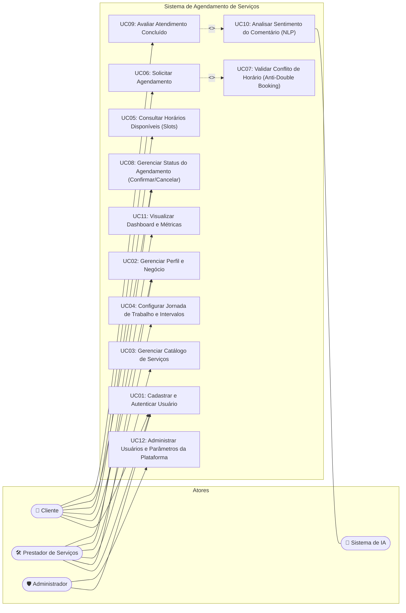
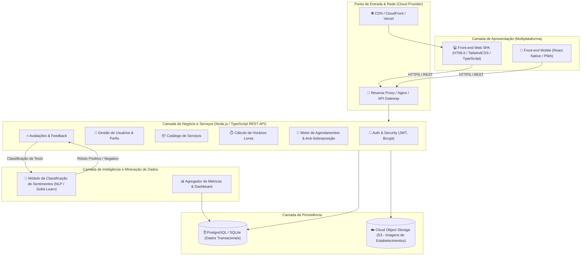
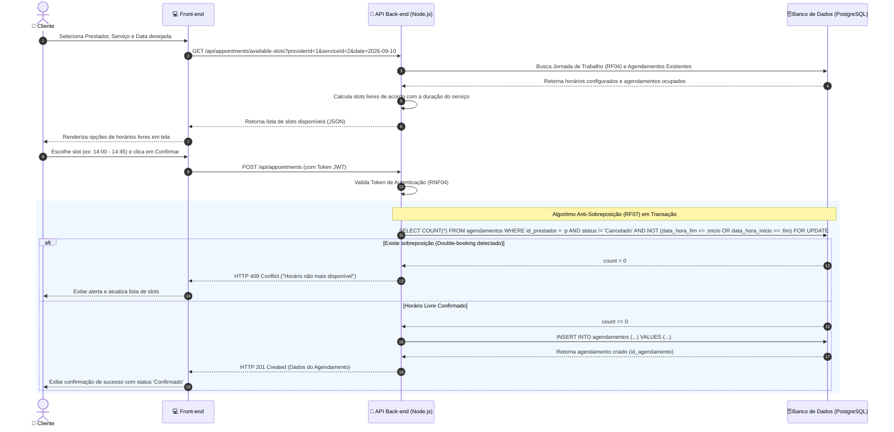
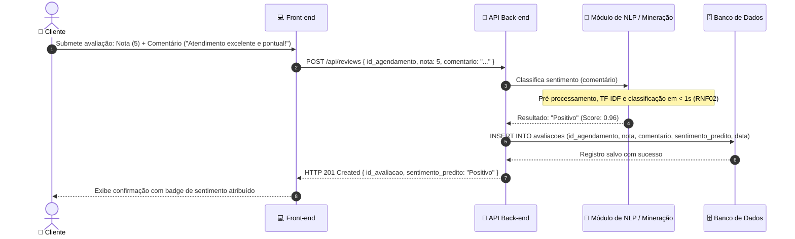

# Modelagem Inicial do Sistema e Arquitetura

**Projeto Interdisciplinar (PI) – 6º Semestre**  
**Tema:** Sistema de Agendamento de Serviços Multiplataforma  
**1ª Sprint:** Modelagem inicial (Casos de Uso, Arquitetura e Sequência)

---

## 1. Diagrama de Casos de Uso (UML)

O diagrama abaixo ilustra as principais interações dos três atores do sistema (**Cliente**, **Prestador de Serviços** e **Administrador**), bem como as interações com o sistema interno de Inteligência Artificial.

---

## 2. Diagrama de Arquitetura da Solução

O sistema adota uma arquitetura em camadas desacoplada e baseada em microsserviços/módulos RESTful, com separação estrita entre front-end, lógica de negócios, camada de persistência e módulo analítico de inteligência artificial.

---

## 3. Diagrama de Sequência: Agendamento e Anti-Sobreposição

O fluxo a seguir demonstra a garantia de conformidade com o **RF06**, **RF07** e **RNF01**, assegurando que a reserva de horários não gere conflitos entre diferentes clientes.

---

## 4. Diagrama de Sequência: Avaliação e Análise de Sentimento (IA)

Fluxo ilustrando a interação pós-atendimento com inferência automática de sentimento (**RF09**, **RF10**, **RNF02**):

