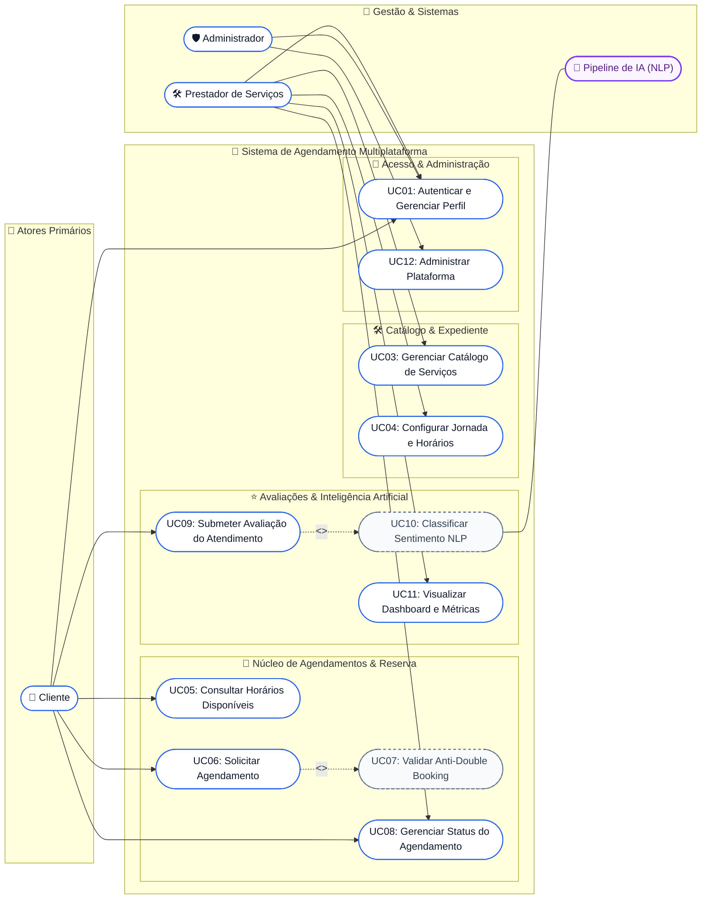
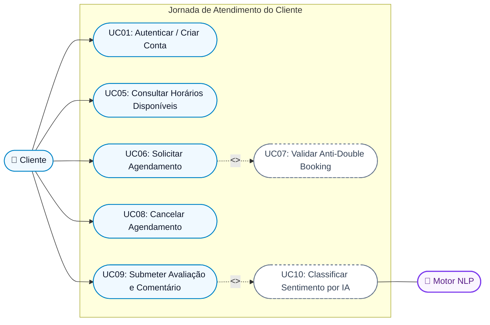
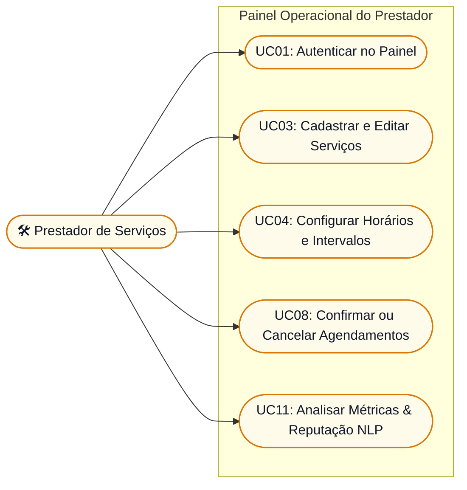
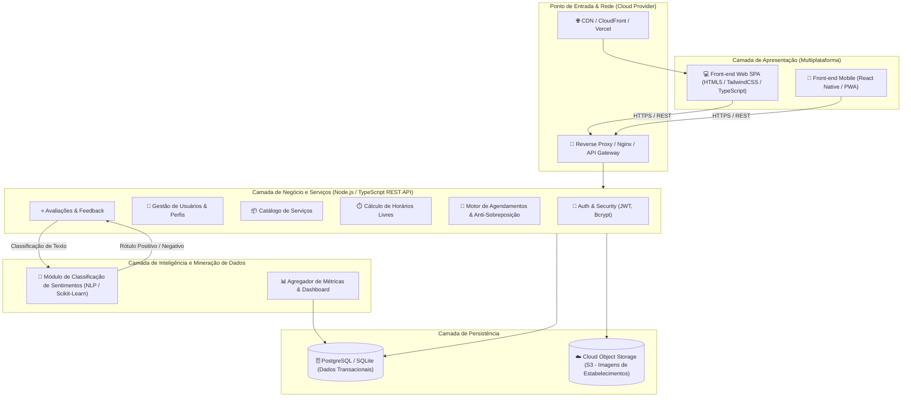
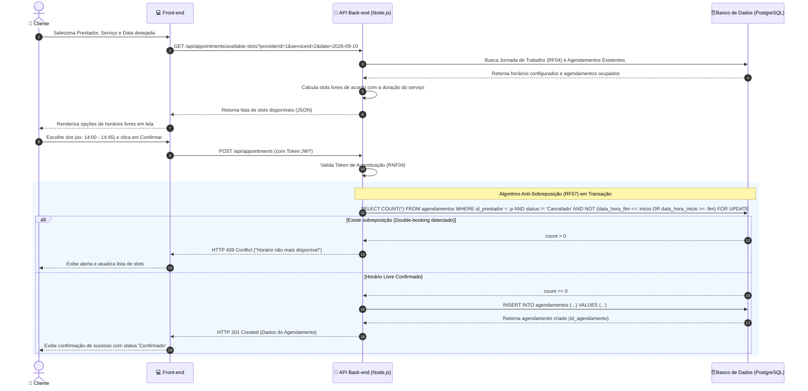
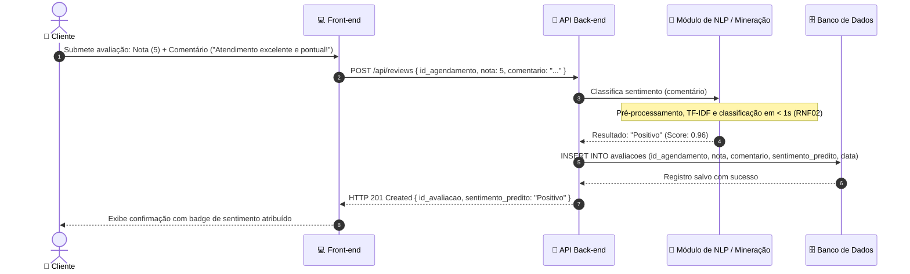

# Modelagem Inicial do Sistema e Arquitetura

**Projeto Interdisciplinar (PI) – 6º Semestre**  
**Tema:** Sistema de Agendamento de Serviços Multiplataforma  
**1ª Sprint:** Modelagem inicial (Casos de Uso, Arquitetura e Sequência)

---

## 1. Diagramas de Casos de Uso (UML)

O ecossistema divide as responsabilidades entre três atores humanos (**Cliente**, **Prestador de Serviços**, **Administrador**) e um ator computacional especializado (**Pipeline de Inteligência Artificial / NLP**).

Para garantir legibilidade máxima e organização modular no GitHub, apresentamos a **Visão Geral Consolidada**, complementada pelas **Visões Focalizadas por Ator** e pela **Tabela de Especificação Detalhada**.

---

### 1.1 Visão Geral Consolidada do Sistema

---

### 1.2 Visão Focalizada: Jornada do Cliente (Reserva & Avaliação)

Fluxo limpo e direto destacando o caminho do cliente desde a consulta de slots livres até a inferência de sentimento pós-atendimento:

---

### 1.3 Visão Focalizada: Gestão do Prestador & Painel Analítico

Fluxo operacional do prestador para manter seus serviços, jornada e acompanhar o feedback dos clientes:

---

### 1.4 Especificação Detalhada dos Casos de Uso

| ID | Caso de Uso | Atores Participantes | Tipo | Descrição Resumida | Requisito Relacionado |
| :---: | :--- | :--- | :---: | :--- | :---: |
| **UC01** | Autenticar e Gerenciar Perfil | Cliente, Prestador, Admin | Primário | Cadastro, login com senha criptografada (bcrypt) e emissão de token JWT. | RF01, RF02, RNF04 |
| **UC02** | Gerenciar Perfil e Negócio | Cliente, Prestador | Primário | Manutenção de dados de contato, endereço e dados do estabelecimento. | RF02 |
| **UC03** | Gerenciar Catálogo de Serviços | Prestador | Primário | Criação, alteração de preço, duração em minutos e status ativo de serviços. | RF03 |
| **UC04** | Configurar Expediente e Intervalos | Prestador | Primário | Definição da grade semanal de trabalho (abertura, fechamento e almoço). | RF04 |
| **UC05** | Consultar Horários Disponíveis | Cliente | Primário | Visualização dinâmica de slots vagos na data escolhida, sem horários fantasmas. | RF05 |
| **UC06** | Solicitar Agendamento | Cliente | Primário | Seleção do serviço e horário para reserva na agenda do prestador. | RF06 |
| **UC07** | Validar Anti-Double Booking | Sistema | `<<include>>` | Bloqueio automático de concorrência que impede agendamentos simultâneos. | RF07, RNF01 |
| **UC08** | Gerenciar Status do Agendamento | Cliente, Prestador | Primário | Mudança de estados semafóricos (Pendente ➔ Confirmado ➔ Cancelado ➔ Concluído). | RF08, RNF06 |
| **UC09** | Submeter Avaliação do Atendimento | Cliente | Primário | Atribuição de nota de 1 a 5 estrelas e comentário em texto natural após a conclusão. | RF09 |
| **UC10** | Classificar Sentimento NLP | Sistema de IA | `<<trigger>>` | Processamento TF-IDF e classificação estatística em tempo real (< 10ms). | RF10, RNF02, RNF03 |
| **UC11** | Visualizar Dashboard e Métricas | Prestador | Primário | Indicadores visuais de volume de atendimentos e satisfação líquida dos clientes. | RF11 |
| **UC12** | Administrar Parâmetros Globais | Administrador | Primário | Gestão da infraestrutura, bloqueio de contas irregulares e auditoria do sistema. | RF12 |

---

## 2. Diagrama de Arquitetura da Solução

O sistema adota uma arquitetura em camadas desacoplada e baseada em microsserviços/módulos RESTful, com separação estrita entre front-end, lógica de negócios, camada de persistência e módulo analítico de inteligência artificial.

---

## 3. Diagrama de Sequência: Agendamento e Anti-Sobreposição

O fluxo a seguir demonstra a garantia de conformidade com o **RF06**, **RF07** e **RNF01**, assegurando que a reserva de horários não gere conflitos entre diferentes clientes.

---

## 4. Diagrama de Sequência: Avaliação e Análise de Sentimento (IA)

Fluxo ilustrando a interação pós-atendimento com inferência automática de sentimento (**RF09**, **RF10**, **RNF02**):

