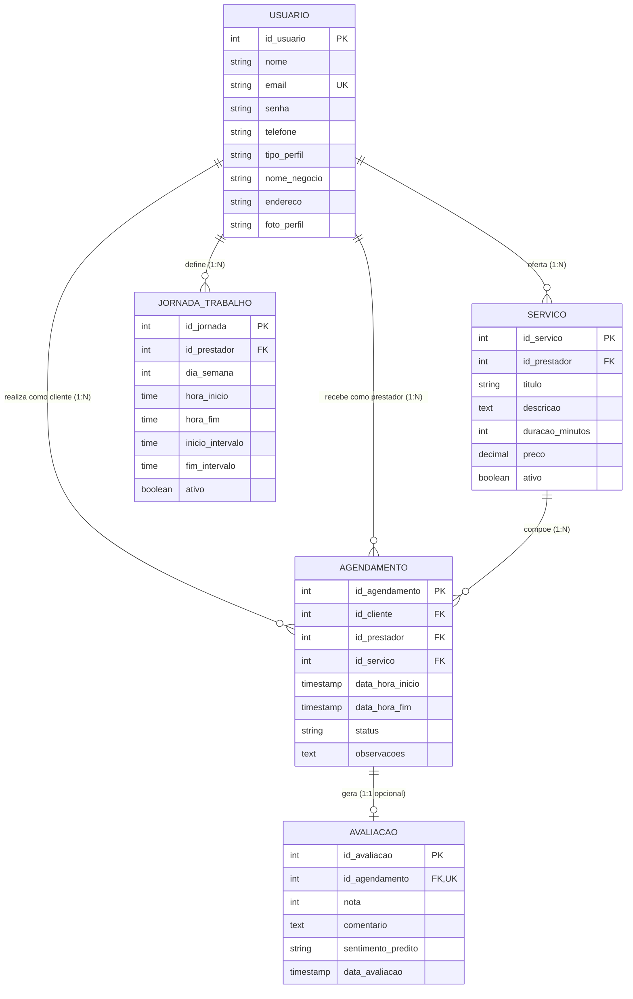

# Modelagem de Banco de Dados: Conceitual e Lógico

**Projeto Interdisciplinar (PI) – 6º Semestre**  
**Tema:** Sistema de Agendamento de Serviços Multiplataforma  
**1ª Sprint:** Banco de dados modelado (conceitual e lógico)

---

## 1. Modelo Conceitual de Dados

O modelo conceitual abstrai as regras de negócio e mapeia as entidades do domínio, seus atributos essenciais e as cardinalidades de relacionamento, conforme especificado no arquivo de concepção da disciplina.

### 1.1 Diagrama Entidade-Relacionamento (ER Mermaid)

### 1.2 Regras de Negócio e Cardinalidades

| Relacionamento | Cardinalidade | Descrição do Negócio |
| :--- | :---: | :--- |
| **Prestador $\to$ Oferta $\to$ Serviço** | **1 : N** | Um prestador de serviços pode cadastrar e gerenciar múltiplos serviços no seu catálogo. Cada serviço pertence a exatamente um único prestador. |
| **Prestador $\to$ Define $\to$ Jornada** | **1 : N** | Um prestador possui regras de horário de expediente para cada dia da semana (0 a 6). Um dia específico possui apenas uma jornada ativa por prestador. |
| **Cliente $\to$ Realiza $\to$ Agendamento** | **1 : N** | Um cliente pode agendar diversos atendimentos ao longo do tempo. Cada agendamento pertence a um cliente específico. |
| **Prestador $\to$ Recebe $\to$ Agendamento** | **1 : N** | Um prestador recebe múltiplos agendamentos em sua grade. Cada agendamento é atribuído a um único prestador. |
| **Serviço $\to$ Compõe $\to$ Agendamento** | **1 : N** | Um serviço catalogado pode ser reservado em vários agendamentos. Cada agendamento referencia um serviço base para fins de cálculo de duração e valor. |
| **Agendamento $\to$ Gera $\to$ Avaliação** | **1 : 1 (opcional)** | Um agendamento com status `Concluído` pode gerar uma avaliação pós-atendimento. Uma avaliação está estritamente vinculada a um único agendamento (garantia de unicidade). |

---

## 2. Modelo Lógico Relacional e DDL

O modelo lógico foi normalizado até a **Terceira Forma Normal (3FN)**, eliminando redundâncias, dependências transitivas e garantindo conformidade com o **RNF07 (Integridade de Dados)**.

### 2.1 Estrutura Relacional Normalizada

1. **`usuarios`** (**id_usuario** [PK], nome, email [UK], senha, telefone, tipo_perfil, foto_perfil, nome_negocio, endereco, criado_em, atualizado_em)
2. **`servicos`** (**id_servico** [PK], *id_prestador* [FK $\to$ usuarios.id_usuario], titulo, descricao, duracao_minutos, preco, ativo, criado_em, atualizado_em)
3. **`jornadas_trabalho`** (**id_jornada** [PK], *id_prestador* [FK $\to$ usuarios.id_usuario], dia_semana, hora_inicio, hora_fim, inicio_intervalo, fim_intervalo, ativo, [UK: id_prestador + dia_semana])
4. **`agendamentos`** (**id_agendamento** [PK], *id_cliente* [FK $\to$ usuarios.id_usuario], *id_prestador* [FK $\to$ usuarios.id_usuario], *id_servico* [FK $\to$ servicos.id_servico], data_hora_inicio, data_hora_fim, status, observacoes, criado_em, atualizado_em)
5. **`avaliacoes`** (**id_avaliacao** [PK], *id_agendamento* [FK, UK $\to$ agendamentos.id_agendamento], nota, comentario, sentimento_predito, data_avaliacao)

### 2.2 Dicionário de Dados

#### Tabela: `usuarios`
| Coluna | Tipo | Nulo? | Chave | Descrição |
| :--- | :--- | :---: | :---: | :--- |
| `id_usuario` | INT / SERIAL | Não | PK | Identificador único do usuário |
| `nome` | VARCHAR(120) | Não | - | Nome completo do usuário |
| `email` | VARCHAR(160) | Não | UK | E-mail corporativo/pessoal para login |
| `senha` | VARCHAR(255) | Não | - | Hash seguro gerado via bcrypt (RNF03) |
| `telefone` | VARCHAR(20) | Não | - | Telefone com DDD para notificações |
| `tipo_perfil`| VARCHAR(20) | Não | - | Domínio restrito: `'Cliente'`, `'Prestador'`, `'Admin'` |
| `foto_perfil`| VARCHAR(255) | Sim | - | URI/Caminho da foto no storage |
| `nome_negocio`| VARCHAR(120)| Sim | - | Nome fantasia do estabelecimento (Prestadores) |
| `endereco` | VARCHAR(200) | Sim | - | Endereço físico do prestador |
| `criado_em` | TIMESTAMP | Não | - | Data/hora de registro do usuário |

#### Tabela: `servicos`
| Coluna | Tipo | Nulo? | Chave | Descrição |
| :--- | :--- | :---: | :---: | :--- |
| `id_servico` | INT / SERIAL | Não | PK | Identificador do serviço ofertado |
| `id_prestador` | INT | Não | FK | Referência ao usuário prestador proprietário |
| `titulo` | VARCHAR(120) | Não | - | Título descritivo do serviço |
| `descricao` | TEXT | Sim | - | Detalhamento dos procedimentos incluídos |
| `duracao_minutos` | INT | Não | - | Duração estimada (> 0) para cálculo de slots |
| `preco` | DECIMAL(10,2) | Não | - | Valor cobrado pelo serviço em R$ |
| `ativo` | BOOLEAN | Não | - | Flag indicando se o serviço está disponível |

#### Tabela: `jornadas_trabalho`
| Coluna | Tipo | Nulo? | Chave | Descrição |
| :--- | :--- | :---: | :---: | :--- |
| `id_jornada` | INT / SERIAL | Não | PK | Identificador da regra de horário |
| `id_prestador`| INT | Não | FK | Prestador ao qual a jornada se aplica |
| `dia_semana` | INT | Não | - | Dia da semana (0=Dom, 1=Seg, ..., 6=Sáb) |
| `hora_inicio` | TIME | Não | - | Horário de início do expediente diário |
| `hora_fim` | TIME | Não | - | Horário de término do expediente diário |
| `inicio_intervalo`| TIME | Sim | - | Início do intervalo de almoço/descanso |
| `fim_intervalo`| TIME | Sim | - | Término do intervalo de almoço/descanso |
| `ativo` | BOOLEAN | Não | - | Indicador de funcionamento no dia |

#### Tabela: `agendamentos`
| Coluna | Tipo | Nulo? | Chave | Descrição |
| :--- | :--- | :---: | :---: | :--- |
| `id_agendamento` | INT / SERIAL | Não | PK | Identificador único do agendamento |
| `id_cliente` | INT | Não | FK | Usuário cliente que reservou o serviço |
| `id_prestador`| INT | Não | FK | Usuário prestador que executará o serviço |
| `id_servico` | INT | Não | FK | Serviço selecionado para o agendamento |
| `data_hora_inicio`| TIMESTAMP | Não | - | Timestamp exato de início da sessão |
| `data_hora_fim` | TIMESTAMP | Não | - | Timestamp exato de término da sessão |
| `status` | VARCHAR(20) | Não | - | Status: `'Pendente'`, `'Confirmado'`, `'Cancelado'`, `'Concluído'` |
| `observacoes` | TEXT | Sim | - | Anotações adicionais do cliente ou prestador |

#### Tabela: `avaliacoes`
| Coluna | Tipo | Nulo? | Chave | Descrição |
| :--- | :--- | :---: | :---: | :--- |
| `id_avaliacao` | INT / SERIAL | Não | PK | Identificador único da avaliação |
| `id_agendamento` | INT | Não | FK, UK | Referência 1:1 ao agendamento avaliado |
| `nota` | INT | Não | - | Escala de 1 a 5 estrelas |
| `comentario` | TEXT | Sim | - | Feedback textual do cliente |
| `sentimento_predito` | VARCHAR(15) | Sim | - | Rótulo predito por NLP: `'Positivo'` ou `'Negativo'` |
| `data_avaliacao` | TIMESTAMP | Não | - | Data e hora em que a avaliação foi enviada |

---

## 3. Script SQL DDL Executável

O script completo com as instruções de `CREATE TABLE`, `CONSTRAINTS`, `FOREIGN KEYS` e `INDEXES` está disponível em:  
➡️ [schema.sql](file:///C:/Users/hugo/Documents/Faculdade/docs/schema.sql)
