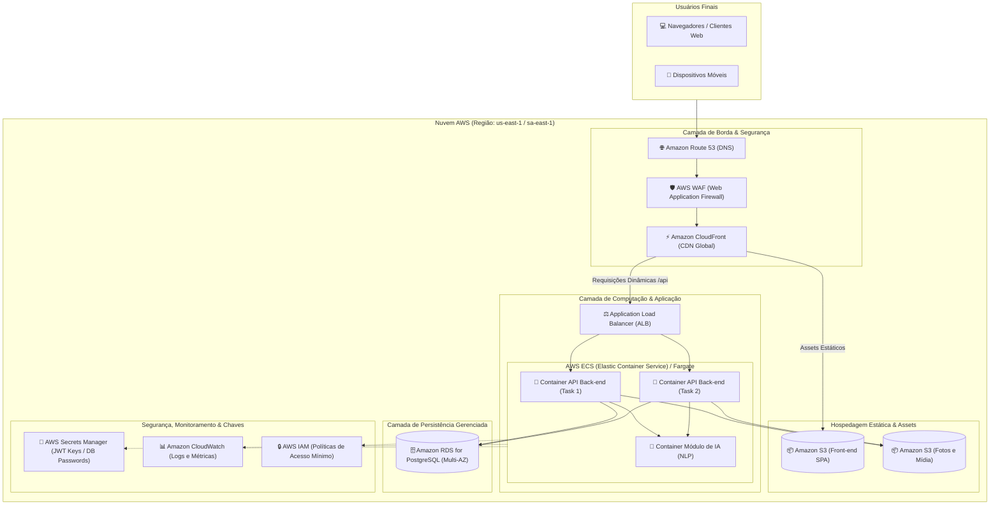

# Computação em Nuvem II: Definição e Justificativa dos Serviços

**Projeto Interdisciplinar (PI) – 6º Semestre**  
**Disciplina-Satélite:** Computação em Nuvem II  
**Professor Responsável:** Prof. Me. Alexandre Gomes  
**Tema:** Sistema de Agendamento de Serviços Multiplataforma  
**1ª Sprint:** Definição e justificativa dos serviços em nuvem a serem utilizados

---

## 1. Visão Geral da Arquitetura em Nuvem

Para atender aos requisitos de alta disponibilidade (**RNF08**), tempo de resposta ágil (**RNF01** e **RNF02**) e segurança rigorosa com criptografia (**RNF03** e **RNF04**), foi selecionada a plataforma de nuvem pública **AWS (Amazon Web Services)**, complementada por serviços de borda e orquestração de contêineres Docker.

A arquitetura em nuvem é orientada a microsserviços desacoplados e *serverless/containers*, reduzindo custos operacionais durante a fase inicial e permitindo escalabilidade automática sob demanda.

---

## 2. Diagrama de Arquitetura em Nuvem (AWS)

---

## 3. Seleção e Justificativa Detalhada dos Serviços

| Serviço AWS | Categoria | Função no Projeto | Justificativa Técnica |
| :--- | :--- | :--- | :--- |
| **Amazon S3** *(Simple Storage Service)* | Armazenamento de Objetos | Hospedagem dos arquivos estáticos do front-end e upload de fotos de perfil e estabelecimentos. | Altíssima durabilidade (99.999999999%), custo quase nulo para pequenas cargas, elimina a necessidade de gerenciar servidores web dedicados para o front-end estático. |
| **Amazon CloudFront** | CDN *(Content Delivery Network)* | Distribuição com cache de borda (*edge locations*) com terminação SSL/TLS automática. | Garante que os arquivos do front-end e imagens carreguem com latência mínima para os usuários no Brasil, reduzindo tráfego direto para a aplicação. |
| **AWS ECS + AWS Fargate** | Computação / Contêineres | Orquestração da API Node.js/TypeScript e do módulo de Machine Learning empacotados em Docker. | **Serverless para contêineres:** Não requer provisionamento ou gerenciamento de instâncias EC2 subjacentes. Escala horizontalmente de acordo com a carga de agendamentos e garante isolamento seguro. |
| **Application Load Balancer (ALB)** | Redes / Balanceamento | Distribuição inteligente de carga HTTP/HTTPS para os contêineres da API. | Suporte nativo a *health checks*, roteamento baseado em caminhos (`/api/v1/*`) e tolerância a falhas para cumprir o **RNF08**. |
| **Amazon RDS for PostgreSQL** | Banco de Dados Gerenciado | Persistência transacional dos dados de usuários, serviços, agendamentos e avaliações. | Oferece backups automáticos pontuais (*Point-In-Time Restore*), patches de segurança gerenciados, criptografia em repouso e suporte a *Multi-AZ* para alta disponibilidade. |
| **AWS Secrets Manager** | Segurança & Conformidade | Armazenamento criptografado do `JWT_SECRET`, credenciais de banco e chaves de API. | Cumpre rigorosamente os requisitos **RNF03** e **RNF04**, evitando o vazamento de credenciais em arquivos de código ou repositórios públicos. |
| **Amazon CloudWatch** | Observabilidade & Logs | Coleta de logs das rotas da API, métricas de latência e alarmes de indisponibilidade. | Permite validar em tempo real se os requisitos de latência (**RNF01 < 2s** e **RNF02 < 1s**) estão sendo cumpridos em ambiente de produção. |

---

## 4. Alinhamento com Requisitos Não Funcionais

1. **Alta Disponibilidade e Resiliência (RNF08):**
   - Utilização de zonas de disponibilidade distintas (*Multi-AZ*) no Amazon RDS e distribuição de tarefas no ECS Fargate.
   - Caso um contêiner sofra falha inesperada, o orquestrador provisiona automaticamente uma nova réplica sem interrupção para o usuário final.
2. **Desempenho e Latência Reduzida (RNF01 e RNF02):**
   - Distribuição CDN global com nós em São Paulo (Edge Location) para o front-end.
   - Módulo de IA otimizado em contêiner dedicado para atender à inferência em menos de 1 segundo.
3. **Segurança e Criptografia (RNF03 e RNF04):**
   - Todo o tráfego externo trafega sob HTTPS (TLS 1.3).
   - Comunicação interna entre API e RDS isolada em sub-redes privadas (*VPC Private Subnet*).
   - Senhas criptografadas com `bcrypt` no banco e tokens de autorização `JWT` com chaves rotacionadas via Secrets Manager.

---

## 5. Planejamento de Custos e Ambiente Educacional

Durante as Sprints 1 e 2, o ambiente utilizará o nível de gratuidade da AWS (*AWS Free Tier*), podendo também ser testado em plataformas PaaS alternativas de baixo custo para desenvolvimento ágil, como **Render** (para containers Docker) e **Supabase / Neon** (para PostgreSQL gerenciado), mantendo 100% de compatibilidade com a arquitetura final da 3ª Sprint.
