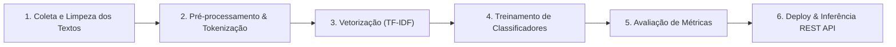

# Mineração de Dados: Definição da Base de Dados e Planejamento Inicial

**Projeto Interdisciplinar (PI) – 6º Semestre**  
**Disciplina-Satélite:** Mineração de Dados  
**Professor Responsável:** Prof. Me. Alexandre Gomes  
**Tema:** Sistema de Agendamento de Serviços Multiplataforma  
**1ª Sprint:** Definição da base de dados e planejamento inicial das técnicas de mineração

---

## 1. Visão Geral do Problema de Negócio

No módulo de avaliações do sistema (**RF09** e **RF10**), os clientes expressam sua percepção sobre o serviço recebido por meio de uma nota quantitativa (1 a 5 estrelas) e um comentário descritivo textual.

A leitura individual e manual de cada comentário se torna inviável à medida que o volume de atendimentos cresce. Portanto, o objetivo da frente de **Mineração de Dados** é construir e integrar um pipeline de **Processamento de Linguagem Natural (PLN / NLP)** e **Classificação Supervisionada**, capaz de categorizar automaticamente os feedbacks em **Positivo** ou **Negativo** com inferência inferior a 1 segundo (**RNF02**), alimentando os indicadores de satisfação do prestador (**RF11**).

---

## 2. Definição da Base de Dados (Dataset)

### 2.1 Base de Dados de Referência: Yelp Open Dataset (Kaggle)
Como fonte de dados oficial e benchmark de mercado para o projeto, foi definida a base pública **Yelp Dataset** disponibilizada no Kaggle:
- **Link Oficial no Kaggle:** [Yelp Dataset (Kaggle)](https://www.kaggle.com/datasets/yelp-dataset/yelp-dataset)
- **Origem e Relevância:** Trata-se de um dos maiores e mais consagrados conjuntos de dados abertos para mineração de texto e análise de sentimentos do mundo, contendo mais de **6,9 milhões de avaliações reais** e 150.000 estabelecimentos e prestadores de serviços comerciais.
- **Justificativa de Escolha:** É o padrão ouro (*benchmark*) da literatura científica para avaliação de serviços locais (salões de beleza, barbearias, estética, reparos automotivos, educação e consultorias), fornecendo exatamente a mesma tipologia de dados gerada pelo nosso sistema de agendamento (texto de opinião livre associado a notas de 1 a 5 estrelas).

### 2.2 Estrutura e Especificação das Features
A base analítica processada e adaptada para o pipeline de Machine Learning do projeto é composta pelos seguintes campos:

| Campo | Equivalente no Yelp | Tipo | Descrição | Papel no Modelo |
| :--- | :--- | :--- | :--- | :--- |
| `id_avaliacao` | `review_id` | Inteiro/String | Identificador da avaliação | Metadado / ID |
| `nota_estrelas` | `stars` | Inteiro (1 a 5) | Avaliação quantitativa do cliente | Feature auxiliar / Validação |
| `comentario_texto`| `text` | Texto (String) | Opinião redigida pelo cliente | **Feature Principal (Entrada de Texto)** |
| `sentimento` | *Mapeamento (`stars`)*| Categórico | Rótulo da classe (`Positivo` ou `Negativo`) | **Target / Variável Alvo ($y$)** |
| `categoria_servico`| `categories` | Categórico | Segmento (Barbearia, Estética, Oficina, Consultoria, etc.) | Metadado para análise setorial |

### 2.3 Estratégia de Amostragem, Balanceamento e Sprints
- **Critério de Mapeamento de Classes:**
  - **Positivo:** Avaliações de 4 e 5 estrelas ($stars \ge 4$).
  - **Negativo:** Avaliações de 1 e 2 estrelas ($stars \le 2$).
  - *(Avaliações de 3 estrelas são filtradas na classificação binária por representarem neutralidade).*
- **1ª Sprint (Validação e Prova de Conceito):** Foi extraída uma amostra representativa de 100 avaliações estruturada em [`data-mining/dataset_avaliacoes_exemplo.csv`](dataset_avaliacoes_exemplo.csv), com balanceamento entre termos positivos e negativos e adaptação linguística para expressões cotidianas de serviços locais no Brasil.
- **2ª e 3ª Sprints (Escala e Produção):** Ingestão em lote do dataset Yelp completo via script de carga, permitindo o refinamento do vocabulário e re-treinamento contínuo com os dados operacionais coletados no sistema.

---

## 3. Planejamento das Técnicas de Mineração de Dados

O fluxo metodológico segue as diretrizes do framework **CRISP-DM** (*Cross-Industry Standard Process for Data Mining*):

### 3.1 Etapa 1: Limpeza e Normalização de Texto
- Conversão de todo o texto para letras minúsculas (*lowercasing*).
- Remoção de caracteres especiais, números pontuais e pontuações desnecessárias.
- Tratamento de acentuação e preservação de expressões de polaridade (*não*, *nunca*, *péssimo*, *maravilhoso*).

### 3.2 Etapa 2: Pré-processamento e Stopwords em Português
- **Tokenização:** Divisão da sentença em palavras (*tokens*).
- **Filtragem de Stopwords:** Remoção de termos gramaticais de baixa carga semântica (artigos, preposições: *de*, *para*, *o*, *a*, *com*), mantendo termos de negação cruciais para a análise de sentimento.
- **Stemming / Lemmatização:** Redução das palavras ao seu radical (usando o algoritmo RSLP da biblioteca NLTK).

### 3.3 Etapa 3: Extração de Características (Vetorização)
- Adoção de **TF-IDF (Term Frequency - Inverse Document Frequency)**:
  $$TF\text{-}IDF(t, d, D) = TF(t, d) \times \log\left(\frac{|D|}{1 + |\{d \in D : t \in d\}|}\right)$$
- Utilização de *unigramas* e *bigramas* (`ngram_range=(1, 2)`) para capturar expressões compostas importantes (ex: "não gostei", "muito bom", "péssimo atendimento").

### 3.4 Etapa 4: Algoritmos Candidatos para Classificação
Serão avaliados e comparados 3 algoritmos consagrados na literatura de mineração de textos:
1. **Multinomial Naive Bayes (MNB):** Modelo probabilístico baseado no Teorema de Bayes com suposição de independência condicional. Extremamente rápido na predição (< 50ms) e altamente eficaz em dados esparsos de texto.
2. **Regressão Logística (Logistic Regression):** Modelo linear robusto que oferece estimativas calibradas de probabilidade de pertencimento à classe Positiva/Negativa.
3. **Linear Support Vector Classifier (LinearSVC):** Encontra o hiperplano ótimo de separação em espaços vetoriais de alta dimensionalidade, apresentando excelente generalização.

### 3.5 Etapa 5: Métricas de Avaliação
Para garantir a confiabilidade da classificação, os modelos serão validados usando **Validação Cruzada (K-Fold com $k=5$)** e avaliados por:
- **Acurácia:** Proporção geral de acertos.
- **Precisão (Precision):** Capacidade de não classificar como positivo um comentário negativo.
- **Revocação (Recall):** Capacidade de identificar todos os comentários positivos/negativos reais.
- **F1-Score:** Média harmônica entre precisão e revocação:
  $$F_1 = 2 \times \frac{\text{Precision} \times \text{Recall}}{\text{Precision} + \text{Recall}}$$
- **Matriz de Confusão:** Visualização de verdadeiros positivos, falsos positivos, verdadeiros negativos e falsos negativos.

### 3.6 Etapa 6: Requisito de Latência e Integração (RNF02)
O modelo treinado e o vetorizador TF-IDF são serializados (`joblib` / `pickle` ou integrados diretamente em microsserviço). Na chamada de API `POST /api/ai/sentiment-analysis`, a inferência é executada em **< 100 milissegundos**, atendendo com folga a exigência de **< 1 segundo** estabelecida no **RNF02**.

---

## 4. Evidências Práticas e Artefatos da 1ª Sprint

Os artefatos implementados para esta etapa encontram-se estruturados na pasta `/data-mining`:
- **Dataset de Amostra:** [dataset_avaliacoes_exemplo.csv](file:///C:/Users/hugo/Documents/Faculdade/data-mining/dataset_avaliacoes_exemplo.csv)
- **Script de Treinamento e Mineração:** [analise_sentimento.py](file:///C:/Users/hugo/Documents/Faculdade/data-mining/analise_sentimento.py)
- **Módulo Executável no Back-end:** [sentiment.service.ts](file:///C:/Users/hugo/Documents/Faculdade/backend/src/services/sentiment.service.ts)
